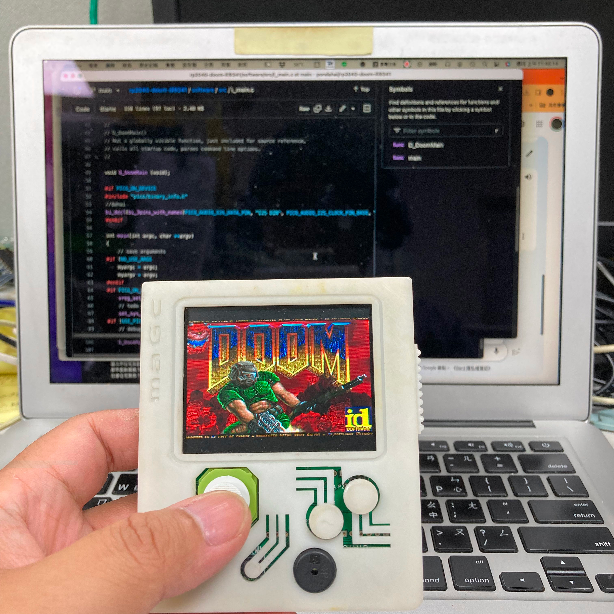
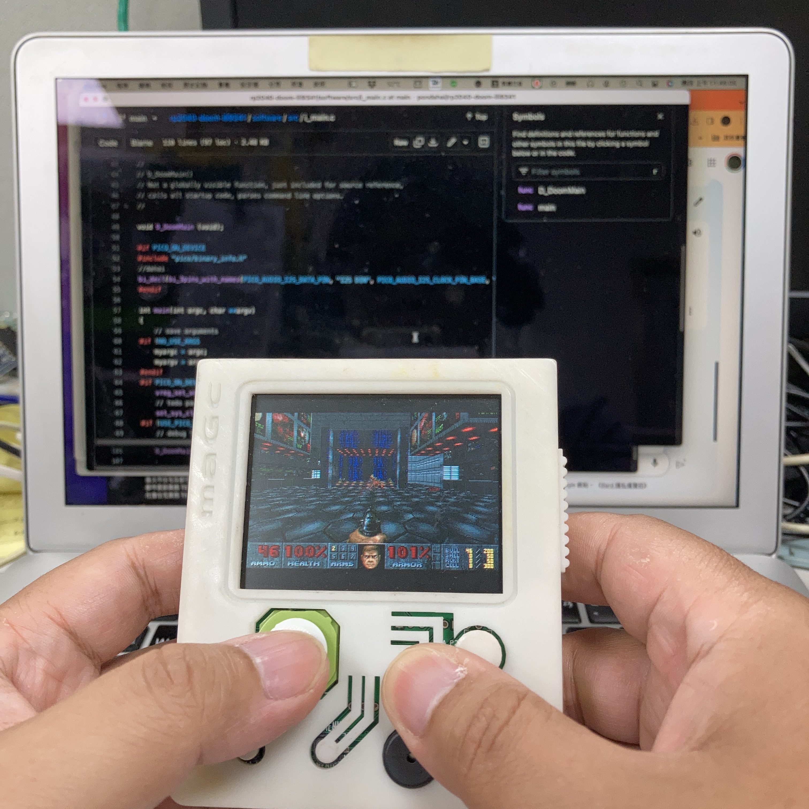
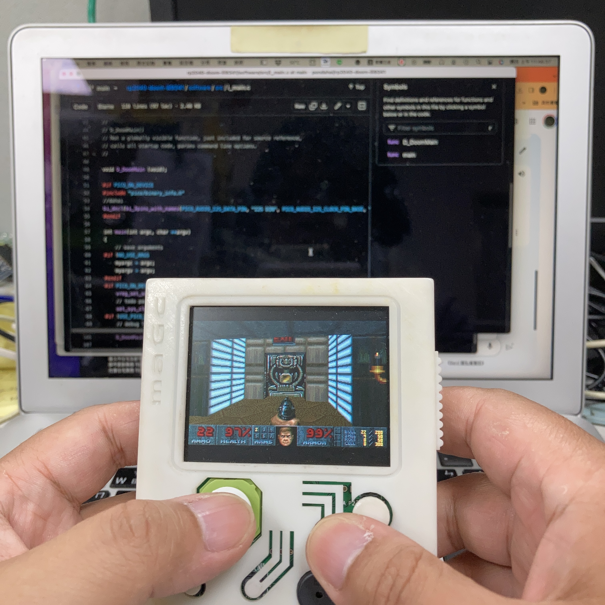

改編自 https://github.com/kilograham/rp2040-doom

感謝kilograham做了絕大部分的貢獻 他把doom源碼做了很大的改寫 讓doom可以在rp2040(樹莓派pico)上運行 我只是修改成可以在LCD(ILI9341)上顯示

我在這裡只有放我改過的源碼 並且在修改的地方插入//dahai這樣的記號 主要的修改邏輯是 1.關掉用不到或是衝突的GPIO 2.將原本的scanvideo輸出關閉，改成將緩衝區資料送到LCD

Adapted from https://github.com/kilograham/rp2040-doom Thanks to kilograham for making most of his contributions. He made a big rewrite of the doom source code. Let doom run on rp2040 (Raspberry Pi pico)

I just modified it so that it can be displayed on the LCD (ILI9341). I only put the source code I changed here. And insert a mark like //dahai in the modified place. The main modification logic is

Turn off the useless or conflicting GPIO
Turn off the original scanvideo output and send the buffer data to the LCD instead.

# rp2040-doom-ili9341  
這是一個專門為MAGC遊戲機設計的DOOM  
有關MAGC請參考hardware/  
  
  
  
  
  
